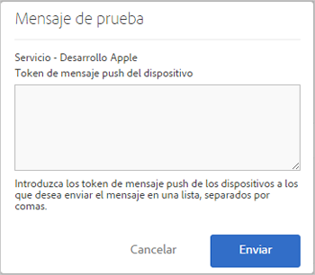

# Requisitos previos para activar la mensajería push {#prerequisites-to-enable-push-messaging}

Debe completar estas tareas antes de configurar la mensajería push en las aplicaciones.

## Active Experience Cloud para su empresa

La empresa de Adobe Analytics debe estar habilitada para Experience Cloud. Puede verificar el estado con el ejecutivo de cuentas de Adobe.

## Instalación y configuración del SDK de Mobile

* **Instalar el SDK de Mobile**

   Para configurar la mensajería push, debe descargar e instalar al menos la versión 4.6 o posterior del SDK de Mobile. Para obtener más información, consulte [Descargar los SDK](/help/using/c-manage-app-settings/c-mob-confg-app/t-config-analytics/download-sdk.md).

* **Configure los servicios push**

   Debe configurar los servicios push en el SDK de Mobile.
Para obtener más información, consulte el contenido siguiente:

   * [Mensajería push en Android](/help/android/messaging-main/push-messaging/push-messaging.md)
   * [Mensajería push en iOS](/help/ios/messaging-main/push-messaging/push-messaging.md)

## Inicie sesión en los servicios principales de Mobile mediante el uso del Adobe ID

>[!IMPORTANT]
>
>Para utilizar la función de servicios push, los usuarios deben iniciar sesión en los servicios principales de Mobile mediante el Adobe ID y la cuenta de Analytics debe estar vinculada a los Adobe ID. La funcionalidad de los servicios Push no está disponible si los usuarios inician sesión con sus cuentas de Adobe Analytics existentes.

Si los usuarios no tienen un Adobe ID, siga estos pasos:

1. (**Administrador de Experience Cloud**) Invitar a los usuarios a Experience Cloud.

1. (**Usuario**) Crear un Adobe ID personal siguiendo las instrucciones recibidas del administrador de Experience Cloud.

   Automáticamente, se envía un mensaje de correo electrónico a cada usuario una vez que el administrador haya realizado el paso anterior.

1. (**Usuarios)** Iniciar sesión en Mobile mediante el uso del Adobe ID.

## Vincular las cuentas de usuario en Experience Cloud

Todos los usuarios deben vincular la cuenta de la solución Analytics desde la organización de Experience Cloud.

1. Para iniciar sesión en Experience Cloud con un Adobe ID, escriba [https://marketing.adobe.com](https://marketing.adobe.com) en un explorador.

1. En la esquina superior derecha, seleccione el nombre de empresa de Analytics.

1. Haga clic en **[!UICONTROL Añadir organización]** y seleccione **[!UICONTROL Adobe SiteCatalyst/Adobe Social]** en la lista desplegable.

1. Escriba el nombre de la empresa y sus credenciales heredadas de la empresa indicada y, a continuación, haga clic en **[!UICONTROL Vincular cuenta]**.

   Ahora, el Adobe ID está vinculado a la cuenta, la empresa y las credenciales de inicio de sesión de Analytics.

Para obtener más información, consulte [Solución de problemas con la vinculación de cuentas](https://docs.adobe.com/content/help/es-ES/core-services/interface/manage-users-and-products/organizations.html).

## Configuración de servicios push y el SDK de servicio de ID en la interfaz de usuario de Mobile

Antes de activar el servicio de ID en la aplicación, se desactiva la sección **[!UICONTROL Servicios push]**. Sin embargo, después de habilitar el servicio de ID, se activa la sección Servicios push. Para obtener más información sobre la activación de Servicios push, consulte [Configuración de opciones de servicio de ID de SDK](/help/using/c-manage-app-settings/c-mob-confg-app/t-config-visitor.md).

>[!IMPORTANT]
>
>Debe hacer clic en **[!UICONTROL Guardar]** para guardar los cambios y actualizar los servicios push.
>
>Puede configurar una aplicación de tienda de aplicaciones para Apple y otra para Google en cada grupo de informes. Si necesita aplicaciones adicionales, por ejemplo, una para un entorno de producción y otra para un entorno de desarrollo, configure una nueva aplicación de tienda de aplicaciones y un nuevo grupo de informes para cada entorno.

* Para **Apple**, arrastre y suelte la clave privada o el certificado. Si la clave privada está cifrada con contraseña, ingrese la contraseña.

   * En **Clave privada**, arrastre y suelte el archivo de clave privada en el cuadro.

      También puede hacer clic en **[!UICONTROL Explorar]** para seleccionar el archivo. Este archivo contiene la clave privada. Puede que el certificado esté incluido en este archivo (`.p12`, `pkcs12`, `.pfx`, `.key`, `.pem`).

   * En **Contraseña privada**, si el archivo de clave privada está cifrado, escriba la contraseña.

      (Condicional) Para el **Certificado**, arrastre y suelte el archivo de certificado en el cuadro. También puede hacer clic en **[!UICONTROL Explorar]** para seleccionar el archivo. Este campo no es necesario en caso de que la clave privada también contenga el certificado ( `.cert`, `.cer`, `.crt`, `.pem`).

* En **Google**, especifique la clave de API para la aplicación.

   Haga clic en **[!UICONTROL Probar]** para validar que la aplicación y Mobile Services estén correctamente configurados. Esta opción resulta útil para la depuración y la solución de problemas.

   Escriba los tokens de Push del dispositivo al cual desea enviar el mensaje. Para enviar el mensaje a varios dispositivos, puede especificar los tokens en una lista separada por comas.

   
