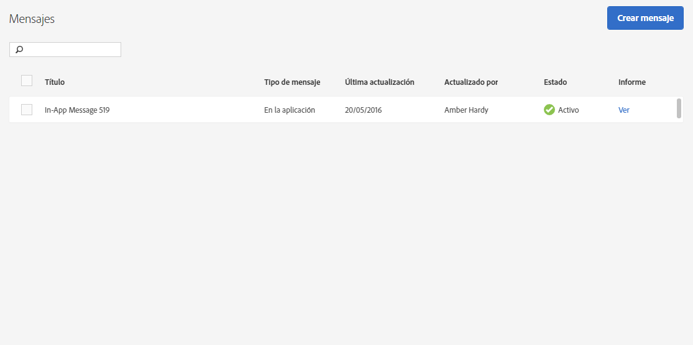

# Administrar mensajes{#manage-messages}

Vea una lista de los mensajes push y en la aplicación con detalles sobre la última actualización y si los mensajes se han activado o desactivado.

Puede duplicar, activar/desactivar y archivar/quitar los mensajes del archivo. También puede crear una vista de un informe que muestre la cantidad de usuarios que vieron el mensaje y la cantidad de usuarios que hicieron clic en él.

Para administrar mensajes, haga clic en ***su nombre_aplicación*** > **[!UICONTROL Mensajería]** > **[!UICONTROL Administrar mensajes]**.

A continuación se proporciona información adicional sobre las tareas que puede completar en los mensajes:

* **Buscar y filtrar mensajes**

   Utilice el cuadro de búsqueda que aparece en la parte superior de la lista para buscar y filtrar mensajes. Cualquier cosa que escriba en el cuadro de búsqueda mostrará los mensajes coincidentes de la lista. La búsqueda funciona en todas las columnas de la tabla. Por ejemplo, puede escribir  `Draft` para mostrar solo los mensajes que tengan este estado. También puede escribir el nombre de un usuario para que solo se muestren mensajes que haya actualizado ese usuario.

   Además del cuadro de búsqueda, también puede hacer clic en el encabezado de cualquier columna para clasificar en orden ascendente o descendente el contenido de esa columna.

   Por ejemplo, si ordena la columna **[!UICONTROL Tipo de mensaje]** en orden ascendente, todos los mensajes en la aplicación se mostrarán antes de los mensajes push. Si ordena la columna **[!UICONTROL Última actualización]** de forma descendente, la lista mostrará los mensajes actualizados más recientemente en la parte superior de la columna.

* **Duplicar mensajes**

   1. Seleccione la casilla de verificación situada junto a uno o varios mensajes y haga clic en **[!UICONTROL Duplicar seleccionados]**.
   1. Seleccione la aplicación para la que desea crear un mensaje de duplicado.
   1. Introduzca un nombre para el mensaje.

      Para duplicar un mensaje para la misma aplicación, escriba un nombre nuevo para el mensaje. Si mantiene el mismo nombre para sobrescribir el mensaje original. Si va a duplicar un mensaje para una aplicación diferente, puede mantener el mismo nombre sin que se sobrescriba el mensaje original.

   1. Haga clic en **[!UICONTROL Duplicar]** o **[!UICONTROL Sobrescribir]** según sea necesario.

* **Desactivar o activar mensajes**

   Para desactivar mensajes, seleccione la casilla de verificación que hay junto a un mensaje activo por lo menos y haga clic en **[!UICONTROL Desactivar seleccionados]**.

   Para activar mensajes desactivados, seleccione la casilla de verificación que hay junto a un mensaje desactivado por lo menos y haga clic en **[!UICONTROL Activar seleccionados]**.

* **Archivar mensajes**

   Para archivar los mensajes y limpiar la lista de mensajes:

   >[!TIP]
   >
   >Antes de poder archivar un mensaje, debe desactivarlo.

   1. Seleccione la casilla de verificación que hay junto a un mensaje desactivado por lo menos y haga clic en **[!UICONTROL Archivar seleccionados]**.

* **Ver mensajes archivados**

   1. Haga clic en **[!UICONTROL Ver archivo]**.
   1. Seleccione la casilla de verificación que hay junto a un mensaje archivado por lo menos y haga clic en **[!UICONTROL Desarchivar seleccionados]**.
