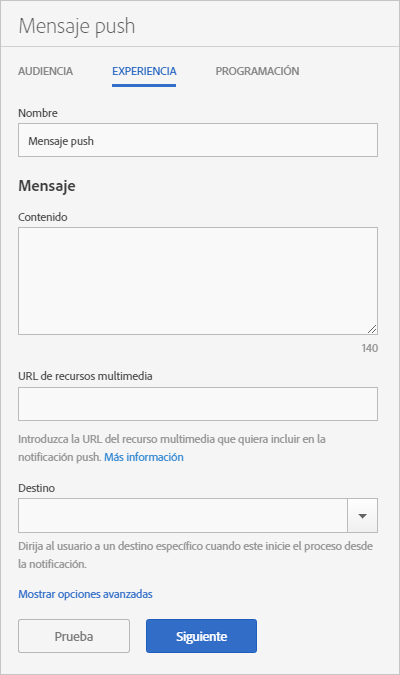

# Experience: push message {#experience-push-message}

Puede configurar opciones de experiencia para mensajes push y mensajes push enriquecidos, incluidas las opciones de nombre, texto del mensaje y destino. También puede configurar opciones avanzadas, incluidas las de carga útil y las opciones personalizadas de los dispositivos iOS.

1. En la página Audiencia para un nuevo mensaje push, haga clic **[!UICONTROL en Experiencia]**.

   

1. Escriba el nombre del mensaje.
1. Rellene los campos siguientes de la sección **[!UICONTROL Mensaje]:**

   * **[!UICONTROL Contenido]**

      Especifique el texto del mensaje. Puede escribir 140 caracteres como máximo.

   * **[!UICONTROL URL de recursos multimedia]**

      Escriba la URL del archivo multimedia que va a usar en el mensaje de notificación push. Para ver los requisitos para utilizar notificaciones push enriquecidas, consulte *Requisitos para notificaciones push enriquecidas* a continuación.

      >[!IMPORTANT]
      >
      >Para mostrar una imagen o un vídeo en una notificación push, recuerde lo siguiente:
      > * El dato `attachment-url` se gestiona en la carga útil push.
      > * La URL de recursos multimedia debe ser capaz de gestionar solicitudes de picos.

   * **[!UICONTROL Destino]**

      Seleccione un destino específico, como un vínculo web, profundo o híbrido, para enviar a los usuarios cuando pulsen en el mensaje. For more information, see [Destinations](/help/using/acquisition-main/c-create-destinations.md).

      >[!TIP]
      >
      >When you use the * **[!UICONTROL Web Link]** or **[!UICONTROL Custom Link]** destination types, the destination type is not tracked. Solo se hace un seguimiento de los **[!UICONTROL vínculos profundos].**

## Requisitos para notificaciones push enriquecidas

Estos son los requisitos para enviar notificaciones push enriquecidas:

* **Versiones admitidas**

   Las notificaciones push enriquecidas se admiten en las versiones siguientes:
   * Android 4.1.0 o una versión posterior
   * iOS 10 o una versión posterior

      >[!IMPORTANT]
      >
      >Recuerde la información siguiente:
      >* Los mensajes push enriquecidos enviados a versiones anteriores se enviarán pero solo se mostrará el texto.
      >* En este momento no se ofrece compatibilidad de visualización.

* **Formatos de archivo**

   Estos son los formatos de archivo admitidos:
   * Imágenes: JPG y PNG
   * Animaciones (solo iOS): GIF
   * Vídeos (solo iOS): MP4

* **Formatos de URL**
   * Solo HTTPS

* **Tamaño**
   * Las imágenes deben tener un formato de 2:1 o se recortarán.

Para obtener más información sobre cómo configurar notificaciones push enriquecidas, consulte los siguientes temas:

* [Recibir notificaciones push en Android](/help/android/messaging-main/push-messaging/c-set-up-rich-push-notif-android.md)
* [Recibir notificaciones push enriquecidas en iOS](/help/ios/messaging-main/push-messaging/c-set-up-rich-push-notif-ios.md)

Para configurar un mensaje push en la página Experiencia:

1. (**Optional**) Click the **[!UICONTROL Show Advanced Options]** link to configure additional options:

   * **[!UICONTROL Carga útil: datos]**

      Proporcione una carga útil push personalizada en JSON que se enviará a la aplicación mediante una notificación push o local. El límite para Android e iOS es de 4 KB.

   * **[!UICONTROL Opciones de Apple: categoría]**

      Proporcione una categoría para las notificaciones push o locales. Para obtener más información, consulte [Managing Your App’s Notification Support](https://developer.apple.com/library/content/documentation/NetworkingInternet/Conceptual/RemoteNotificationsPG/SupportingNotificationsinYourApp.html#//apple_ref/doc/uid/TP40008194-CH4-SW9) (Gestión del soporte para notificaciones de su aplicación) en la *biblioteca para desarrolladores de iOS*.

   * **[!UICONTROL Opciones de Apple: sonido]**

      Proporcione el nombre del archivo de sonido en el paquete de aplicaciones que se debe reproducir. Se establece si no se reproduce un sonido de alerta predeterminado. Para obtener más información, consulte [Managing Your App’s Notification Support](https://developer.apple.com/library/content/documentation/NetworkingInternet/Conceptual/RemoteNotificationsPG/SupportingNotificationsinYourApp.html#//apple_ref/doc/uid/TP40008194-CH4-SW10) (Gestión del soporte para notificaciones de su aplicación) en la *biblioteca para desarrolladores de iOS*.

   * **[!UICONTROL Opciones de Apple: contenido disponible]**

      Seleccione esta opción para que, cuando el mensaje llegue, iOS active la aplicación en segundo plano y le permita ejecutar código basado en la carga útil del mensaje. Para obtener más información, consulte la sección [Apple Push Notification Service](https://developer.apple.com/library/content/documentation/NetworkingInternet/Conceptual/RemoteNotificationsPG/APNSOverview.html#//apple_ref/doc/uid/TP40008194-CH8-SW1) (Servicio de producción de notificaciones push de Apple) en la *biblioteca para desarrolladores de iOS*.

1. (Opcional) Obtenga una vista previa del diseño del mensaje haciendo clic en los siguientes iconos:

   * **[! UICONTROL X Summary}**

      Oculta el panel de vista previa. Haga clic  para volver a mostrar el panel de vista previa.

   * **[!UICONTROL Cambiar la orientación]**

      To change the orientation of the preview from portrait to landscape mode, click . En el caso de los relojes, la orientación cambia de una esfera de reloj redonda a una cuadrada.

   * **[!UICONTROL Vista previa en el reloj del usuario]**

      Para obtener una vista previa del mensaje como aparecerá en los relojes de un usuario, haga clic en el icono .

   * **[!UICONTROL Vista previa en el teléfono móvil de un usuario]**

      Para obtener una vista previa del mensaje como aparecerá en los teléfonos móviles de los usuarios, haga clic en el icono .

   * **[!UICONTROL Vista previa en tablets de un usuario]**

      Para obtener una vista previa del mensaje en la tablet de un usuario, haga clic .
   En la parte inferior del panel de vista previa, puede ver una descripción de la audiencia que seleccionó en el paso anterior.

1. (**Optional**) Click **[!UICONTROL Test]** to push your message to specified devices for testing purposes.
1. Seleccione el servicio y escriba los tokens push de por lo menos un dispositivo en el que desee insertar el mensaje.

   Especifique los tokens en una lista separada por comas para insertar el mensaje en más de un dispositivo.

1. Configurar las opciones de programación del mensaje.

   Para obtener más información, consulte [Programación: mensaje push](/help/using/in-app-messaging/t-create-push-message/c-schedule-push-message.md).
