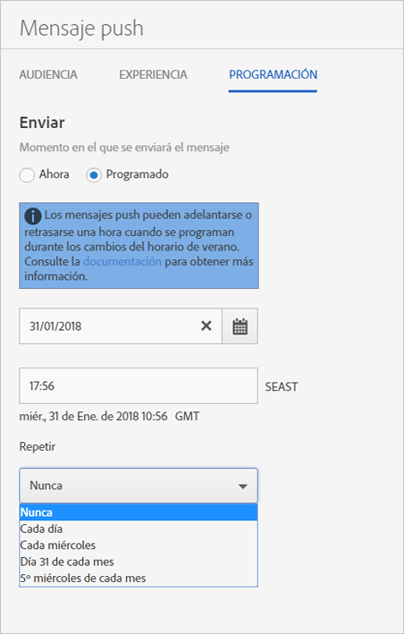

# Programación: mensajes push{#schedule-push-message}

En la interfaz de usuario de Adobe Mobile Services, puede programar la entrega inmediata de un mensaje push, que se entregará más tarde y como evento recurrente. Estos eventos se pueden programar diariamente, semanalmente o mensualmente.

>[!TIP]
>
>Los usuarios pueden modificar la configuración de programación en un trabajo de mensaje push en cualquier momento. Si no hay una fecha aplicable para enviar un mensaje programado recurrente, por ejemplo, un trabajo recurrente mensual cada 31 días, el 31 de febrero o el 5 de martes del mes, no se envía ningún mensaje.

Recuerde la información siguiente:

* El formato de fecha y hora correcto es `hh:mm` y `mm/dd/yyyy`.

* Un mensaje programado se puede editar del modo siguiente:

   * Cambiar la fecha por otra posterior.
   * Cambie el intervalo de repetición a otro intervalo.

      Por ejemplo, si originalmente tenía un mensaje que se enviaba todos los días, puede cambiar la periodicidad a semanal.

## Antes de programar mensajes push recurrentes

Antes de programar mensajes push recurrentes, **debe** saber lo siguiente:

* Las opciones que se muestran en la lista desplegable **[!UICONTROL Repetir]** dependen de la fecha que escriba o seleccione.

   Por ejemplo, si escribe `Saturday, October 7`, se muestran las siguientes opciones:

   * **[!UICONTROL Nunca]**
   * **[!UICONTROL Cada día]**
   * **[!UICONTROL Cada sábado]**
   * **[!UICONTROL Día 7 de cada mes]**
   * **[!UICONTROL Primer sábado de cada mes]**

* Los mensajes push se programan y envían según la hora del meridiano de Greenwich (GMT).

   Por ejemplo, si programó un mensaje recurrente para enviarse todos los sábados a las 12:00 (mediodía) **PST**, a partir del 7 de octubre, el mensaje se enviará el sábado a las 19:00 **GMT**.
* Los mensajes se envían de forma diferente en función de si se encuentra en Estados Unidos, Europa o Asia.

   Por ejemplo, si se encuentra en San José, California, y programa un mensaje para que se envíe el 31 ***de octubre*** a las 17:30 **PST**, el mensaje se enviará el 1 ****** de noviembre a las 12:30 a.m. **GMT**. Si se encuentra en Tokio y programa que se envíe un mensaje el 1 ***de enero a las 5:30 a.m., se enviará el 31*** de diciembre ***a las 8:30 p.m.*** GMT ****.
* Los mensajes push se envían una hora antes o más tarde, dependiendo de cuándo se produzca un ahorro de luz.
* Al consultar el informe de mensajes push, el mensaje se muestra en el huso horario local del sistema.

   Por ejemplo: si la hora de inicio es 12:00 pm **PST**, aunque el mensaje se enviará a las 19: **00 GMT**, el informe del mensaje mostrará la hora de envío a las 12:00 pm **PST**.

## Programar un mensaje push recurrente {#section_675BD754E5A04423A1751193698A978F}

1. Para enviar un nuevo mensaje push, en la página Programar, seleccione **[!UICONTROL Programado]** o **[!UICONTROL Ahora]**.

   Para obtener más información, consulte [Crear un mensaje en la aplicación](/help/using/in-app-messaging/t-create-push-message/t-create-push-message.md).

   Si selecciona **[!UICONTROL Ahora]** el mensaje se inserta inmediatamente. Para evitar que el mensaje se programe inmediatamente, haga clic en **[!UICONTROL Guardar como borrador]**.

   

1. Si selecciona **[!UICONTROL Programado]**, haga clic en el icono del calendario y seleccione o escriba una fecha de inicio.
1. Escriba una hora. 
1. En **[!UICONTROL Repetir]**, seleccione una de las opciones siguientes:

   * **[!UICONTROL Nunca]**
   * **[!UICONTROL Cada día]**
   * **[!UICONTROL Cada miércoles]**
   * **`<Day x>`del mes**

      Las opciones mostradas cambian dependiendo del día que seleccione o escriba como fecha de inicio.
   * **`<nth day>`de cada mes**

      El valor mostrado cambia dependiendo de la fecha que haya seleccionado o escrito como fecha de inicio.

1. En **[!UICONTROL Finalizar repetición]**, escriba una fecha y hora de finalización.
1. Haga clic en una de las opciones siguientes:

   * **[!UICONTROL Guardar como borrador]**

      Esta opción guarda el mensaje en el formato de borrador. Puede elegir esta opción, bien para guardar un mensaje no terminado, o bien para guardar un mensaje a fin de que otro usuario pueda editarlo y aprobarlo antes de activarlo.

      Si selecciona **[!UICONTROL Ahora]** en el paso anterior, el borrador del mensaje se envía inmediatamente al activarlo. Si ha seleccionado una fecha y hora para insertar el mensaje, este se inserta en función de esta programación.

   * **[!UICONTROL Guardar y programar]**

      Esta opción envía el mensaje el día y la hora programados.

Para insertar el borrador del mensaje más tarde, complete una de las siguientes tareas:

* Haga clic en **[!UICONTROL Gestionar mensajes]**, seleccione la casilla de verificación que hay junto al mensaje y haga clic en **[!UICONTROL Activar seleccionados]**.
* Haga clic en **[!UICONTROL Guardar y enviar]** para guardar el mensaje y enviarlo.
