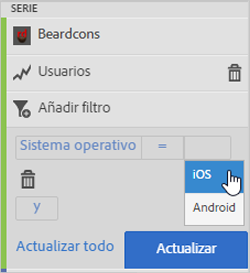
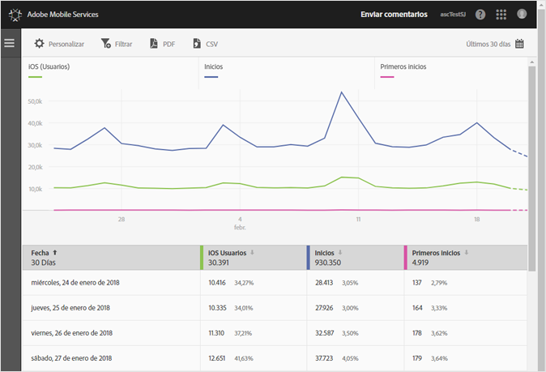
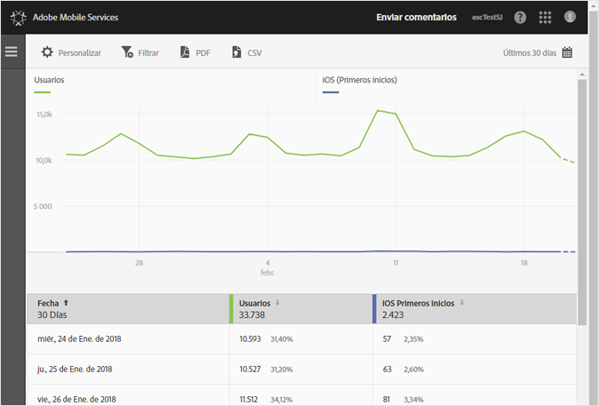

# Añadir filtros a informes{#add-filters-to-reports}

Esta información sirve para personalizar los informes integrados mediante la adición de filtros (segmentos) adicionales.

>[!IMPORTANT]
>
>Las métricas de aplicación de móvil también están disponibles en los informes y análisis de marketing, los análisis específicos, el almacén de datos y otras interfaces de generación de informes de Analytics. Si un tipo de informe o desglose no está disponible en Adobe Mobile, se puede generar usando otra interfaz de generación de informes.

En este ejemplo, personalizaremos el informe **[!UICONTROL Usuarios y sesiones]**, pero las instrucciones sirven para cualquier informe.

1. Open your app and click **[!UICONTROL Usage]** > **[!UICONTROL Users &amp; Sessions]**.

   

   Este informe proporciona una vista completa de las horas extra de los usuarios de la aplicación. Sin embargo, las métricas de las versiones iOS y Android de esta aplicación se recopilan en el mismo grupo de informes. Podemos segmentar usuarios por sistema operativo móvil agregando un filtro personalizado a la métrica Usuarios.

1. Haga clic en **[!UICONTROL Personalizar]**.

   

1. En **[!UICONTROL Usuarios]**, haga clic en **[!UICONTROL Añadir filtro]** y en **[!UICONTROL Añadir regla]**.

1. Seleccione **[!UICONTROL Sistema operativo]** y, en la lista desplegable, seleccione **[!UICONTROL iOS]**.

   

   Para agregar Android como filtro, debe repetir este paso.

1. Haga clic en **[!UICONTROL Y]**, seleccione **[!UICONTROL Sistemas operativos]** en la lista desplegable y elija **[!UICONTROL Android]**.

   Los filtros deberían tener un aspecto similar al siguiente ejemplo:

   

1. Haga clic en **[!UICONTROL Actualizar]**.
1. Para regenerar el informe, haga clic en **[!UICONTROL Ejecutar]**.

   Este informe ahora muestra los usuarios desglosados por sistema operativo. El título del informe se cambió para coincidir con los filtros aplicados al informe.

   

   Puede personalizar más este informe. Desde iOS 8.3, puede añadir la métrica Primeros lanzamientos con un filtro de versión del sistema operativo iOS 8.3 para ver cuántos clientes de iOS 8.3 han actualizado sus aplicaciones y han realizado un primer lanzamiento.
1. En **[!UICONTROL Primeros lanzamientos]**, haga clic en **[!UICONTROL Añadir filtro]** y en **[!UICONTROL Añadir regla]**, seleccione **[!UICONTROL Sistema operativo]** en la lista desplegable y elija **[!UICONTROL iOS]**.
1. Haga clic en **[!UICONTROL Y]**, seleccione **[!UICONTROL Versión del sistema operativo]** en la lista desplegable y elija **[!UICONTROL iOS 8.3]**.

   Los filtros deberían estar como en este ejemplo:

   

1. Haga clic en **[!UICONTROL Actualizar]** y **[!UICONTROL Ejecutar]**.

   Este informe ahora muestra los usuarios con iOS 8.3 que han iniciado la aplicación por primera vez.

   

   Tómese algún tiempo para probar las diferentes opciones del menú de personalización de informes y asegúrese de marcar sus favoritos. Las direcciones URL de informes de Adobe Mobile son completamente funcionales y pueden enviarse por correo electrónico o agregarse a los favoritos.
