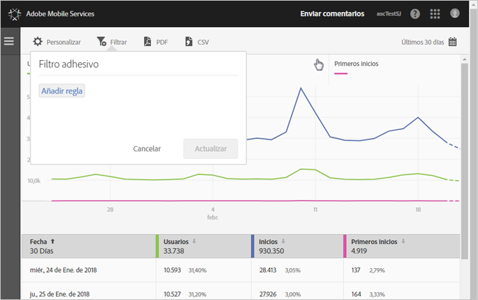

# Add a sticky filter{#add-sticky-filter}

Cree un filtro que incluya distintos informes con el fin de ver el comportamiento de un segmento concreto en todos los informes móviles. Un filtro adhesivo le permite definir un filtro que se aplica a todos los informes sin rutas.

En el siguiente ejemplo se agregan filtros adhesivos para los sistemas operativos iOS y Android al informe **[!UICONTROL Usuarios y sesiones], pero las instrucciones se aplican a cualquier informe o métrica.**

1. Haga clic en el icono **[!UICONTROL Filtro]** en la parte superior de cualquier informe de Adobe Mobile.

   

1. En el cuadro de diálogo Filtro adhesivo, haga clic **[!UICONTROL en Agregar regla]**, seleccione **[!UICONTROL Sistema]** operativo y, en la lista desplegable, seleccione **[!UICONTROL iOS]**.

   Para agregar Android como filtro, repita este paso.

   

1. Click **[!UICONTROL And]**, select **[!UICONTROL Operating Systems]**, and from the drop-down list, select **[!UICONTROL Android]**.

   Los filtros deberían tener un aspecto similar al siguiente ejemplo:

   

1. Click **[!UICONTROL Update]** and **[!UICONTROL Run]**.
