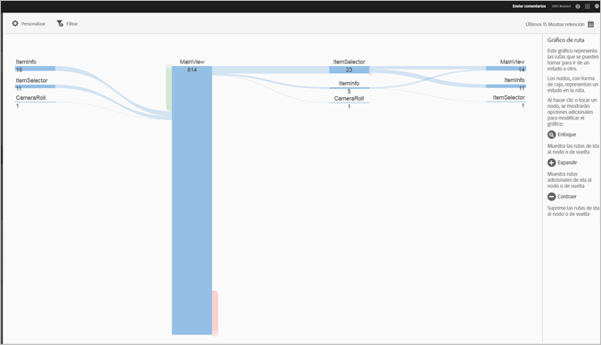

# Ver informe de rutas {#view-paths}

El informe **[!UICONTROL Ver rutas]**, que se basa en el análisis de estas, muestra un gráfico que representa las rutas que pasaron de un estado a otro en la aplicación.

>[!TIP]
>
>Los informes **[!UICONTROL Ver rutas]** y **[!UICONTROL Ver acciones]** son muy parecidos, ya que ambos son informes de rutas. El informe **[!UICONTROL Ver rutas]** permite ver cómo navegan los usuarios en la aplicación de una pantalla a otra. El informe **[!UICONTROL Ver acciones]** muestra la secuencia de acciones y eventos, como clics, selecciones, cambios de tamaño, etc., que los usuarios realizan en la aplicación. Puede utilizar un informe de embudo para combinar la navegación y las acciones en un informe. Para obtener más información, consulte [Embudo](/help/using/usage/reports-funnel.md).

Cada nodo, que es similar a una caja, representa un estado en las rutas de los usuarios a través de una aplicación. Por ejemplo, en la ilustración anterior, el nodo principal representa la cantidad de usuarios que iniciaron la aplicación y navegaron a la vista principal.

Cuando haga clic en un nodo para proporcionar las opciones adicionales que permiten modificar el gráfico, aparecerán iconos como **[!UICONTROL Enfocar]** o **[!UICONTROL Expandir]**. Por ejemplo, si hace clic en el estado **[!UICONTROL MainView]** del nodo principal, aparecen los iconos **[!UICONTROL Enfoque]** y **[!UICONTROL Expandir]**.

Para expandir la vista, haga clic en el icono **[!UICONTROL +]** para mostrar las rutas adicionales que llegan a un nodo o salen de él. En la siguiente ilustración, el estado 1 inicia la aplicación, el estado 2 está viendo la página principal de la aplicación y el estado 3 incluye las siguientes rutas que tomaron los usuarios:

* Navegación al carrete de la cámara
* navegación al selector de elementos
* navegación a la cámara
* navegación a la página de información del elemento

Haga clic en  para aislar el nodo y mostrar las rutas que entran y salen del nodo seleccionado. En la ilustración siguiente, las rutas siguientes precedieron a los usuarios que estaban viendo la vista principal de la aplicación:

* información del elemento
* selector de elementos
* Carrete de cámara
* Cámara

Puede enfocar o expandir varios nodos para obtener una vista detallada de las rutas que siguen los usuarios en la aplicación. Por ejemplo:

Para este informe, puede configurar las siguientes opciones:

* **[!UICONTROL Periodo]** Haga clic en el icono de **[!UICONTROL Calendario]** para seleccionar un periodo personalizado o elegir un periodo preestablecido en la lista desplegable.
* **[!UICONTROL Personalizar]** Personalice los informes cambiando las opciones **[!UICONTROL Mostrar por]**, agregando métricas, filtros, series (métricas) adicionales y mucho más. Para obtener más información, consulte [Personalización de informes](/help/using/usage/reports-customize/reports-customize.md).
* **[!UICONTROL Filtrar]** Haga clic en **[!UICONTROL Filtro]** para crear un filtro que incluya distintos informes con el fin de ver el comportamiento de un segmento en todos los informes móviles. Un filtro adhesivo permite definir un filtro que se aplica a todos los informes sin rutas. Para obtener más información, consulte [Agregar filtro adhesivo](/help/using/usage/reports-customize/t-sticky-filter.md).
* **[!UICONTROL Descargar]** Haga clic en **[!UICONTROL PDF]** o **[!UICONTROL CSV]** para descargar o abrir documentos, compartirlos con otros usuarios que no tengan acceso a Mobile Services o usarlos en presentaciones.